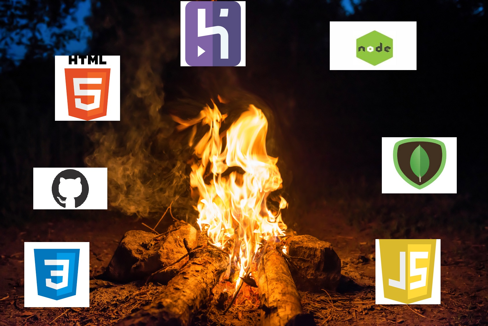

### Date: 6/5/2020

#### By: Brandon Sacco
[GitHub](https://github.com/bsacco0674) | [LinkedIn](https://www.linkedin.com/in/brandonsacco/) |

### ***Description***

##### Your story is an app where people from all over the world can share a bit about themselves. a small platform where people can be heard, seen, and understood.
***

### ***Technologies Used***

### ***How to share***

##### A user may  login with your Google account and just start viewing and making posts, moreover if there is something they feel passionate about they can post a comment, or share a like. (More interaction coming soon!!)

### ***Development and deployment***

##### Trello was used to keep track of development progress along with wireframes, ERD, Userstories, and orginial conspects and can be viewed [here](https://trello.com/b/Vu8fogDq/brandons-blog).
##### The project was deployed via Heroku and can be viewed [here](https://stark-caverns-74545.herokuapp.com/).
***

### ***Screenshots***

###### Main Page

###### Main Page

###### Comment Section

***

### ***Future Updates***

- [x] Add Darkmode
- [x] Add Lightmode
- [x] Add a way to like post/comment
- [ ] Add Themes for each user
- [ ] Add a way to share via social media
- [ ] Show a list of all users
***

### ***Special Thanks***

Thanks again to everyone's hard work and contributions, for without this project would of never gotten off the ground:

[JP Lynch](https://www.linkedin.com/in/jplynchux/), [Samuel Trahan
](https://www.linkedin.com/in/samueltrahan/), [David Stinson
](https://www.linkedin.com/in/david-stinson/),[Linnae Kraemer
](https://www.linkedin.com/in/linnae-kraemer/)